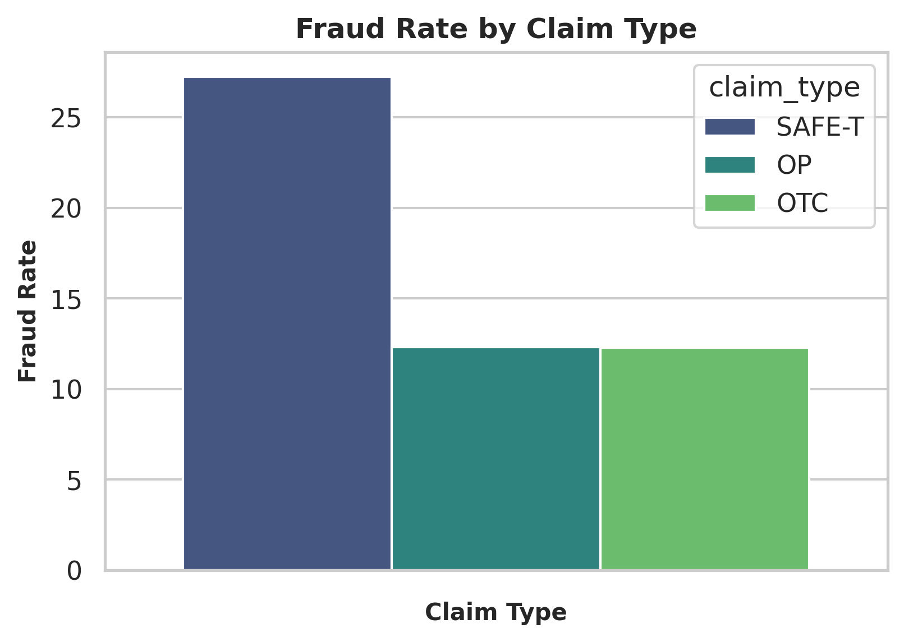

# 🕵️ Amazon Fraud Analysis – Investigation Specialist Workflow Simulation

### 📊 Project Overview
This project replicates the **analytical workflow of an Amazon Investigation Specialist**, focusing on fraud detection, decision-making, and operational risk analytics within return and reimbursement operations.

The goal is to simulate how Amazon’s Risk & Fraud Operations teams identify fraudulent claims, quantify exposure, and optimize process efficiency using **data-driven analysis and statistical validation**.

---

## ⚙️ Tools & Libraries
**Python Stack:** pandas, numpy, matplotlib, seaborn, scipy, statsmodels
**Statistical Tests:** Chi-Square, ANOVA/Welch’s, Correlation, Cramér’s V, Cohen’s d
**Dataset:** Synthetic case-level data (~200K rows) simulating Amazon return & reimbursement workflows
**Environment:** Jupyter Notebook (Python ≥3.9)

---

## 🧮 Analytical Methodology
The analysis integrates:
- **Descriptive analytics** for claim trends and fraud patterns
- **Inferential statistics** (chi-square, ANOVA, t-tests) to validate differences
- **Correlation analysis** to identify numeric relationships
- **Effect-size metrics** to gauge real-world significance

Insights are interpreted both statistically and operationally — balancing data evidence with fraud investigation logic.

---

## 🔍 Key Insights

### 🧩 Fraud Rate & Distribution Analysis
- **SAFE-T** claims show the highest fraud rate (~27%), compared to ~12% in OP and OTC.
- Fraud is slightly more likely on **mobile devices** (~20.5%) and **weekends** (~17%).
- **Region** and **account age** show negligible impact on fraud likelihood.

---

### 🧭 Customer Behavior & Claim Frequency Patterns
- Fraud probability increases slightly with more prior claims (+18%), but the effect size is weak (η² ≈ 0.01).
- Account age and claim recency show **no meaningful correlation** with fraud.
- Resolution times differ statistically between fraud/non-fraud claims but **not operationally** (Cohen’s d = 0.04).

---

### 💰 Transaction & Financial Metrics
- **Claim amount** and **refund amount** are moderately correlated (r = 0.41).
- Refund value does not differ significantly between fraud and non-fraud cases.
- Monetary size has limited standalone predictive power; behavioral variables perform better.

---

### 💳 Payment Method & Operational Attributes
- Fraud likelihood varies slightly across payment methods: highest in **Gift Card** and **COD** (~24%).
- Escalated claims take significantly longer (median = 45 days) than approved/denied ones (~16 days).
- Chargeback frequency alone is not a strong fraud indicator.

---

### ⚖️ Dispute & Chargeback Dynamics
- Fraud rate rises marginally with **disputes and chargebacks** combined (max ≈ 22.2%).
- Although statistically significant, effect sizes are small (Cramér’s V ≈ 0.015).
- These features add incremental value when used together in a composite fraud-risk metric.

---

## 💡 Recommendations
- Combine **behavioral and categorical indicators** (claim reason, payment method, dispute count) into a **composite risk score**.
- Prioritize **SAFE-T** and **subjective claim reasons** (e.g., counterfeit, not received) for enhanced review.
- Streamline **escalation workflows** to reduce SLA delays while maintaining fraud accuracy.
- Focus fraud prevention models on **behavioral patterns**, not transaction size or geography.

---

## 🖼️ Key Visuals

**Fraud Rate by Claim Type**

**Fraud Probability Distribution**

**Fraud by Payment Method**

**Resolution Time by Claim Type**

**Combined Dispute–Chargeback Fraud Rate**

**Fraud Trends 2023 and 2024**

---

## 🏁 Final Summary
This project demonstrates how structured analytics can emulate the **decision logic of Amazon’s Risk & Fraud Operations**.
Through hypothesis testing, behavioral segmentation, and statistical validation, the analysis converts case-level data into **evidence-backed insights** for fraud detection and SOP improvement.

> Case Data → Statistical Evidence → Insight Generation → Operational Action

---

## 🧾 License
This project uses **synthetic data** for educational and illustrative purposes only.
It does not include any proprietary, customer, or confidential information.

---

> 🧾 **Note:** The notebook displayed here was executed on the full dataset (~200k records, ~45 MB)  
> to show complete results and charts.  
> The `/data/sample_case_data.csv` file is a smaller synthetic subset (≈200 records)  
> included for reproducibility.
